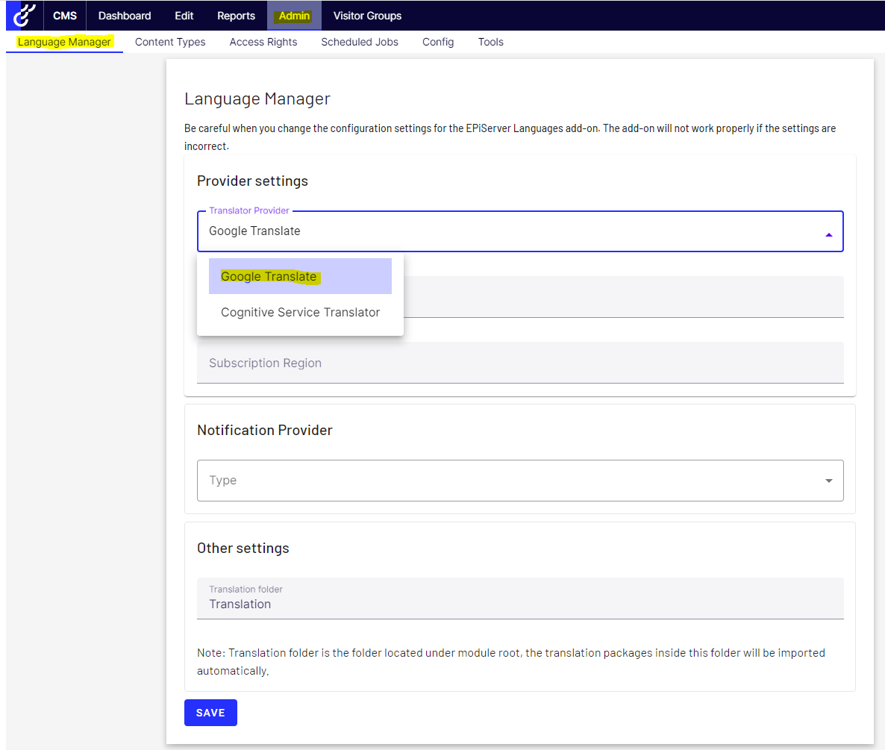
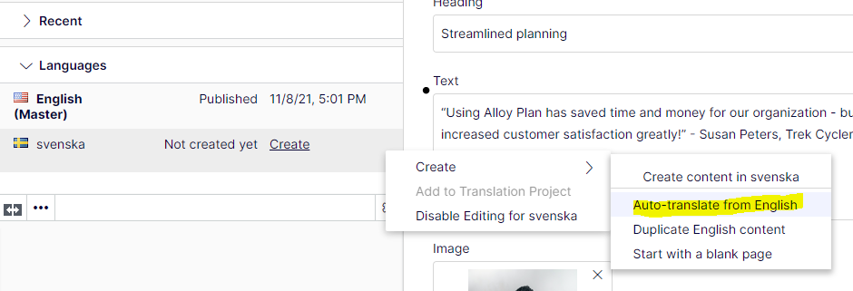

# A2Z.Episerver.Labs.LanguageManager.GoogleTranslate

## Description
[](https://docs.microsoft.com/en-us/dotnet/)
[](http://world.episerver.com/cms/)
[](http://world.episerver.com/cms/)

This extension for Optimizely CMS empowers EPiServer.Labs.LanguageManager to automatically translate content through Google Cloud Translation.

The extension leverages the Google.Cloud.Translation.V2 NuGet package, enabling seamless integration with the Google Cloud Translation API. 

## Installation

The command below will install the addon in your Optimizely project.

```
dotnet add package A2Z.Episerver.Labs.LanguageManager.GoogleTranslate
```

## Configuration

To enable LanguageManager to utilize the Google Translate Provider, configure it as follows



All you need is a **'Subscription Key'** for this extension to function. Find detailed instructions on how to create one here https://cloud.google.com/translate/docs/setup

## Usage

Integrate the Languages gadget and effortlessly auto-translate all your content!



## Contributing

Feel free to submit a pull request if you identify any areas that could be enhanced or improved.

## Feature Requests

If you have new ideas or feature requests that can make this tool even more useful for you or the community, please feel free to open a new issue at the following link.

https://github.com/adnanzameer/A2Z.Episerver.Labs.LanguageManager.GoogleTranslate/issues

## Changelog

[Changelog](CHANGELOG.md)
